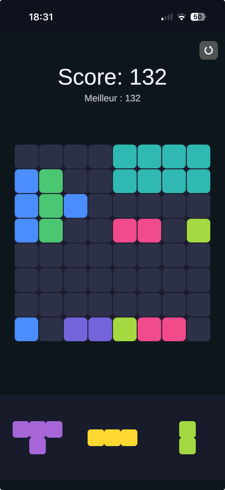

# ZozoBlast

A small Blockblast-style puzzle game built with my daughter Zozo, just for the two of us — but the code is open so anyone curious can read or remix it.

**Play it:** https://obalais.github.io/zozoblast/

Drop pieces on the 8×8 board, clear full rows and columns, and try to beat your best score. Six visual themes unlock as you climb past score milestones.

<p align="center">
  
</p>

## Install on your phone

Open the link above in Safari (iOS) or Chrome (Android), then:

- **iOS:** Share → Add to Home Screen
- **Android:** browser menu → Install app

Once installed it works offline, runs fullscreen, and persists your saved game and best score locally.

## Stack

- **Engine:** Unity 6 LTS, 2D, Personal license
- **Language:** C#
- **Target:** WebGL (no compression, so it works over plain HTTP and on iOS Safari)
- **Hosting:** GitHub Pages
- **PWA:** custom service worker + manifest for offline play and install-to-home-screen
- **Persistence:** `PlayerPrefs` flushed to IndexedDB via a small `.jslib` plugin

The UI is built programmatically from `GameController.cs` — there's no main scene to edit visually beyond a single `EventSystem` + `GameController` GameObject. This makes the project easy to read top-down.

## Project layout

```
Assets/
├── Scripts/
│   ├── Model/         Pure C# game logic (Grid, Piece, PieceShapes) — no Unity deps
│   ├── View/          UI rendering (GridView, PieceView, theme manager, sprite factories)
│   ├── Controller/    Orchestration (GameController, scene builder)
│   ├── Audio/         AudioManager wrapping AudioSource.PlayOneShot
│   └── Persistence/   JSON-serialized game state in PlayerPrefs
├── Resources/Audio/   Place / clear / invalid / gameover SFX (CC0)
├── Plugins/WebGL/     .jslib for WebAudio resume + IndexedDB sync
├── WebGLTemplates/
│   └── MinimalClean/  Custom HTML template + service worker + manifest + icons
└── Editor/
    └── MainSceneBuilder.cs   `Tools → Blockblast → Build Main Scene` to regenerate the scene
```

## Develop locally

Requires Unity 6 LTS (`6000.4.x`).

1. Open the project in Unity Hub.
2. If the scene is empty, run `Tools → Blockblast → Build Main Scene`.
3. Press Play.

To build for the web:

1. `File → Build Settings`, target **WebGL**, build into `Builds/WebGL/`.
2. Serve locally with `python3 scripts/serve.py` (defaults to port 8000).
3. Open `http://127.0.0.1:8000` in your browser.

## Deploy to GitHub Pages

The deploy script does not build — it only publishes whatever's already in `Builds/WebGL/`. So the full flow is:

1. In Unity: `File → Build Profiles → Build` (target WebGL, output to `Builds/WebGL/`).
2. Run `./scripts/deploy.sh`.

The script stamps `sw.js` with the current git short SHA so installed PWAs invalidate their cache automatically, then copies `Builds/WebGL/` to the `gh-pages` branch via a git worktree and pushes. GitHub Pages serves the new version within a minute.

## Credits

- Sound effects: public-domain (CC0) from Freesound.
- Icon artwork: generated with Gemini Nano Banana, post-processed to fit iOS icon constraints.
- Code: written collaboratively with [Claude Code](https://claude.com/claude-code).

## License

MIT for the source code. Asset license terms apply to the audio (CC0) and icon as noted above.
